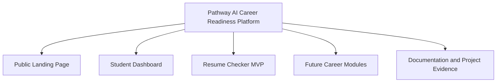
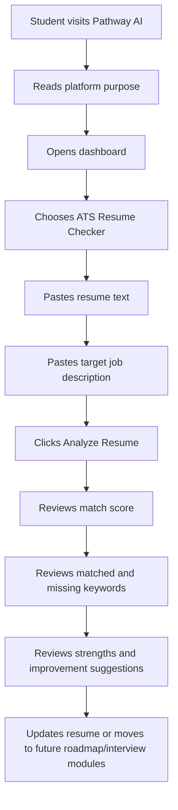

# Pathway AI MVP Implementation Document

## Implementation Summary

Pathway AI is a student career readiness platform designed to help students move from career confusion to a clear preparation plan. The current MVP implements a polished public landing page, a dashboard workspace, and a working ATS-style resume checker that runs locally without external AI keys.

The resume checker accepts resume text and a target job description, compares keyword coverage, checks for resume sections, generates a match score, and returns strengths plus recommended improvements. This creates a demonstrable implementation slice while leaving room for future AI, authentication, and database integration.

## Functional Decomposition: Level 0

## Functional Decomposition: Level 1

```mermaid
flowchart TD
    A["Pathway AI"] --> B["Landing Page"]
    B --> B1["Brand story and value proposition"]
    B --> B2["Module overview"]
    B --> B3["Responsible AI/privacy messaging"]
    B --> B4["Navigation into dashboard"]

    A --> C["Dashboard"]
    C --> C1["Readiness summary cards"]
    C --> C2["Core module status"]
    C --> C3["Operational journey timeline"]
    C --> C4["Resume checker entry point"]

    A --> D["Resume Checker"]
    D --> D1["Resume text input"]
    D --> D2["Job description input"]
    D --> D3["Keyword extraction"]
    D --> D4["Match score calculation"]
    D --> D5["Section completeness checks"]
    D --> D6["Strengths and improvement recommendations"]

    A --> E["Planned Modules"]
    E --> E1["Career Path Explorer"]
    E --> E2["Skill Gap Roadmap"]
    E --> E3["Mock Interview Coach"]
```

## Technical Design Flowchart

```mermaid
flowchart LR
    U["User opens app"] --> L["Next.js App Router"]
    L --> H["Landing page /"]
    H --> D["Dashboard /dashboard"]
    D --> R["Resume Checker /resume-checker"]
    R --> I["Client-side text inputs"]
    I --> T["Tokenize resume and job description"]
    T --> K["Extract target role keywords"]
    K --> M["Compare resume keyword coverage"]
    M --> S["Calculate match score"]
    S --> C["Check resume sections"]
    C --> F["Render feedback cards"]
```

## Operational Flowchart: User Point of View

## Implemented Features

- Public landing page with Pathway AI branding, Apple-style typography, and module overview.
- Shared Pathway AI logo component.
- Dashboard route at `/dashboard`.
- Resume checker route at `/resume-checker`.
- Local resume/job description analysis without API keys.
- Match score based on keyword coverage and resume section completeness.
- Matched keyword and missing keyword chips.
- Resume section checks for education, projects, skills, experience, and impact.
- Strengths and improvement recommendations tailored to student resumes.
- Responsive layouts for desktop and mobile.

## Current Limitations

- No user authentication yet.
- No database or saved user history yet.
- Resume checker uses deterministic local analysis rather than a live AI API.
- Career path, roadmap, and interview modules are represented as planned dashboard surfaces, not full functional modules.
- File upload is not implemented; the MVP uses paste-in text fields.

## Future Enhancements

- Add Clerk authentication.
- Add database persistence with Prisma and PostgreSQL or Neon.
- Add AI-generated resume recommendations through a secure server route.
- Add resume file parsing for PDF/DOCX uploads.
- Build the Career Path Explorer, Skill Gap Roadmap, and Mock Interview Coach as connected modules.
- Allow students to save, export, and delete generated feedback.
