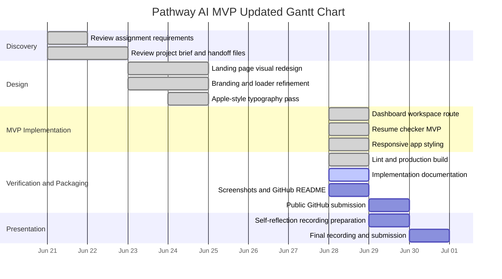
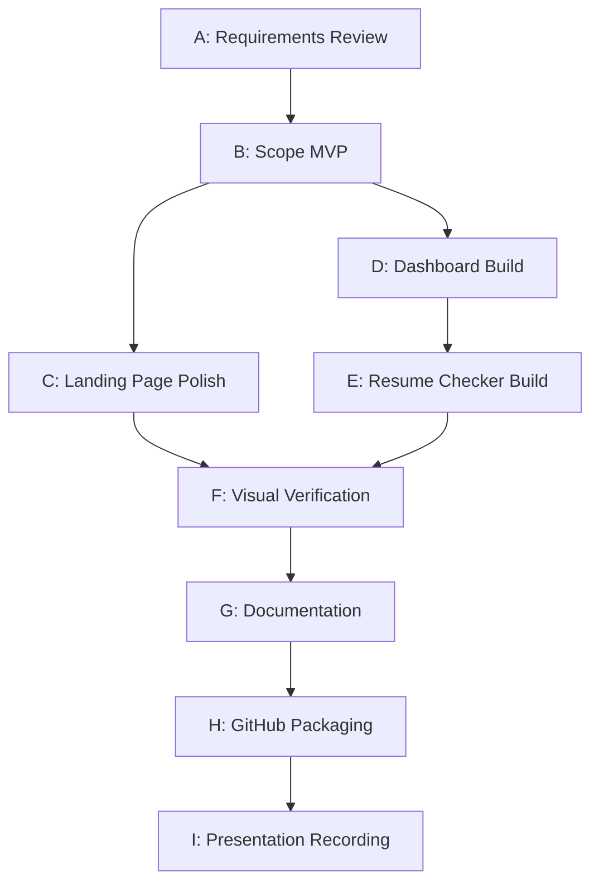

# Pathway AI Project Management Artifacts

## Updated Gantt Chart

## Critical Path Analysis

The critical path is the sequence of tasks that must be completed for the assignment deliverable to be accepted as a runnable implementation package.

### Critical Path Tasks

| Task | Dependency | Status |
| --- | --- | --- |
| Review assignment requirements | None | Complete |
| Define MVP scope | Requirements review | Complete |
| Implement dashboard | MVP scope | Complete |
| Implement resume checker | Dashboard route | Complete |
| Verify lint/build | Implementation | Complete |
| Capture screenshots | Working local app | Pending |
| Complete documentation | Implementation details | In progress |
| Publish public GitHub repo | Code and README | Pending |
| Record self-reflection | Working app and docs | Pending |

## PERT Chart

## PERT Estimate Table

| Activity | Optimistic | Most Likely | Pessimistic | Expected Time |
| --- | ---: | ---: | ---: | ---: |
| Requirements review | 0.5 day | 1 day | 1.5 days | 1.0 day |
| MVP scope definition | 0.5 day | 1 day | 2 days | 1.1 days |
| Landing page polish | 1 day | 2 days | 3 days | 2.0 days |
| Dashboard build | 0.5 day | 1 day | 2 days | 1.1 days |
| Resume checker build | 0.5 day | 1 day | 2 days | 1.1 days |
| Verification and screenshots | 0.5 day | 1 day | 1.5 days | 1.0 day |
| Documentation package | 1 day | 1.5 days | 3 days | 1.7 days |
| GitHub packaging | 0.5 day | 1 day | 2 days | 1.1 days |
| Self-reflection recording | 0.5 day | 1 day | 2 days | 1.1 days |

Expected time uses the PERT formula: `(Optimistic + 4 * Most Likely + Pessimistic) / 6`.
