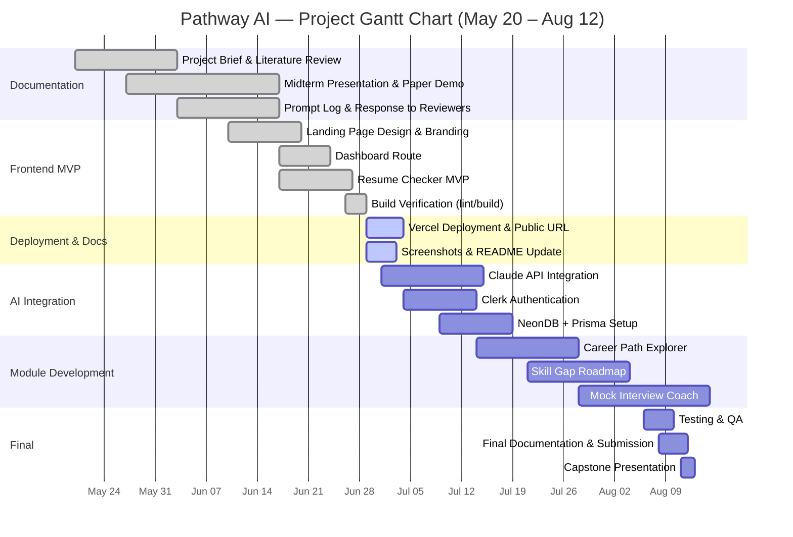
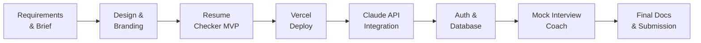
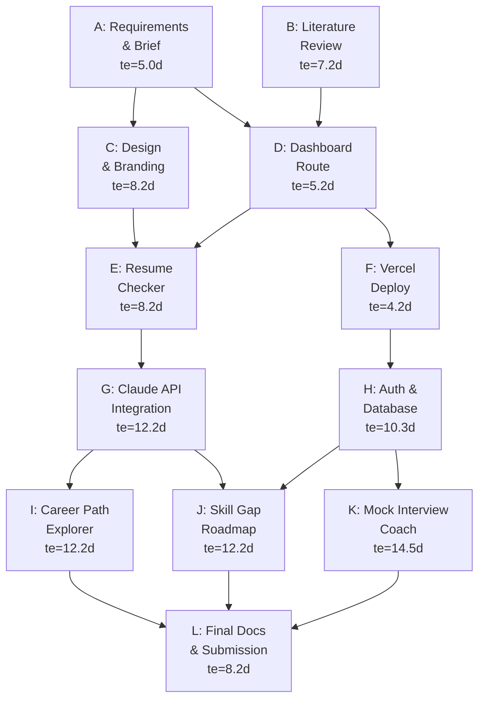

# Pathway AI Project Management Artifacts

**Project window: May 20, 2026 – August 12, 2026**

## Gantt Chart

## Critical Path Analysis

The critical path is the sequence of dependent tasks that directly controls the August 12 submission date.

### Critical Path Tasks

| Task | Expected Duration | Status |
|------|-------------------|--------|
| Requirements & Project Brief | 5 days | Complete |
| Design & Branding | 8 days | Complete |
| Dashboard & Resume Checker MVP | 8 days | Complete |
| Vercel Deployment | 4 days | In Progress |
| Claude API Integration | 12 days | Planned |
| Authentication & Database | 10 days | Planned |
| Mock Interview Coach | 14 days | Planned |
| Final Documentation & Submission | 8 days | Planned |

**Total critical path: ~69 expected days. Project window: 84 days. Float: ~15 days.**

## PERT Estimates

te = (Optimistic + 4 × Most Likely + Pessimistic) / 6

| ID | Task | O | M | P | te |
|----|------|---|---|---|----|
| A | Requirements & Brief | 3 | 5 | 7 | 5.0 |
| B | Literature Review | 5 | 7 | 10 | 7.2 |
| C | Design & Branding | 5 | 8 | 12 | 8.2 |
| D | Dashboard Route | 3 | 5 | 8 | 5.2 |
| E | Resume Checker MVP | 5 | 8 | 12 | 8.2 |
| F | Vercel Deployment | 2 | 4 | 7 | 4.2 |
| G | Claude API Integration | 7 | 12 | 18 | 12.2 |
| H | Auth + Database | 7 | 10 | 15 | 10.3 |
| I | Career Path Explorer | 7 | 12 | 18 | 12.2 |
| J | Skill Gap Roadmap | 7 | 12 | 18 | 12.2 |
| K | Mock Interview Coach | 10 | 14 | 21 | 14.5 |
| L | Final Docs & Submission | 5 | 8 | 12 | 8.2 |

## PERT Chart

